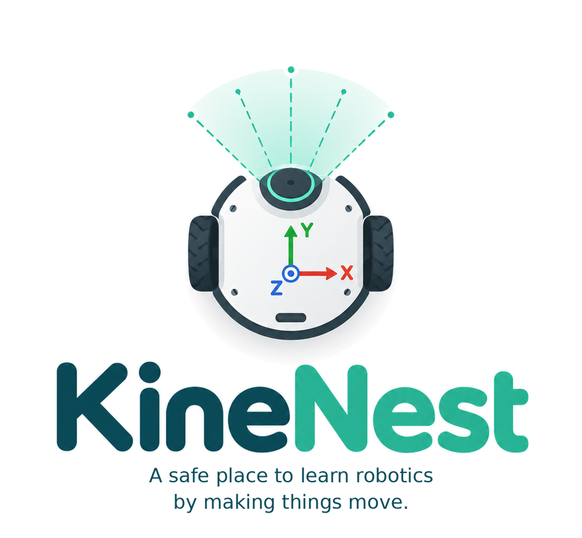

# KineNest

A safe place to learn robotics by making things move.

KineNest is a free, open-source teaching environment for robotics communication, sensors, perception and coordinate frames. Students write real Python and compile C++ in their browser throughout the 25 coding exercises in Sessions 2–6. Session 1 introduces the CLI, graph and topics without choosing a programming language. Interactive simulations require no robotics installation or account. Exercises mirror common ROS™ 2 APIs and command-line workflows so the same concepts transfer to a real robotics workspace.

This branch is a full-C++ release candidate. It has not been merged or published to production; see the [candidate report and preview status](docs/CPP_PARITY_RELEASE.md).

## Try online

[Open the current KineNest release](https://kinenest.com/). In this candidate, the welcome page opens the course through **Start Session 1**, and Session 1 has the explicit `/session-01.html` route. Python and C++ begin in Session 2. Chrome and Firefox are tested. Edge and Safari remain best-effort and have not been independently verified.

## What students learn

Nodes, topics, messages, publishers, subscribers, callbacks, LiDAR, camera arrays, services, parameters, actions, odometry, transforms and debugging. One shared runtime connects the terminals, Python, C++ programs and robot within each page.

No installation, account, backend, API key or paid service is required. The first Python run downloads Pyodide and NumPy; initial use requires internet.

## Workstation views

[Session 1](docs/media/session-01.png) · [Camera perception](docs/media/session-03.png) · [Debugging](docs/media/session-06.png) · [Python/C++ comparison](docs/media/compare.png). A short demonstration video is planned; see the [demo outline](docs/DEMO.md).

## Six-session course

Each session is designed for approximately 90 minutes. Sessions 1–2 introduce the basics; allow time for explanation and experimentation. All coding exercises in Sessions 2–6 offer Python, C++ and Compare.

| Session | Focus | Exercises |
| --- | --- | --- |
| 1 | Nodes & Topics | CLI discovery and robot commands |
| 2 | Callbacks & LiDAR | 4 Python/C++ exercises |
| 3 | Perception & Services | 6 Python/C++ exercises |
| 4 | Parameters & Actions | 5 core exercises + optional cancellation |
| 5 | Odometry & Frames | 5 core exercises + obstacle integration |
| 6 | Debugging Challenge | 2 repairs + an integrated beacon mission |

The UI and teaching material support English, Nederlands, Français, Español, Deutsch, Português and Italiano. Code, ROS identifiers and technical output remain English. Switching UI language preserves code and running programs. Light/dark and split/stacked layouts are available. Course timings and translations still need classroom and native-speaker review.

## For lecturers

Send students a URL and begin. No ROS installation, Docker, student cloud accounts or local Python setup. Exercises, worlds, hints and translations are version-controlled alongside the course.

Fork the repository, edit lesson JSON and enable Pages. See [AUTHORING.md](docs/AUTHORING.md), [course pacing](docs/COURSE.md) and [validation](docs/VALIDATION.md). No authoring GUI or grading database is required.

## How it works

Static HTML, CSS and JavaScript provide the workstation. Real Python and NumPy run in a Pyodide Web Worker; real browser-compiled C++ runs as WebAssembly in a separate execution worker. Educational message classes and robotics APIs connect student programs to the same graph used by the CLI. Canvas renders sensors and obstacles; SVG displays coordinate frames from actual runtime transforms.

Camera: 320 × 240 at 8 Hz. LiDAR: 120 rays at 5 Hz. Odometry: ideal 2D pose at 5 Hz. Stop terminates the worker, including an infinite loop. Slow callbacks drop sensor frames instead of accumulating work. Output and terminal history are bounded.

The simulator publishes `/camera/image_raw`, `/scan`, `/odom` and `/tf` throughout Sessions 2–6, even before student code runs. In Learning terminals, use `ros2 topic hz /scan`, `ros2 topic echo /scan --field ranges --once`, or `ros2 topic echo /camera/image_raw --field width --once`. These are simulated ROS topics within the browser tab. In Session 3, **Add LiDAR obstacle** places an optional box for sensor exploration; **Show LiDAR rays** changes only the map overlay. Solid rays show returns and dashed rays show the sensor's reach when nothing is hit.

## Python and experimental C++

Python and browser-compiled C++ are available throughout all 25 coding exercises in Sessions 2–6, including the optional action-cancellation exercise. Real Clang/LLD compiles C++ to WebAssembly in an isolated browser worker. Both languages use the same simulator, graph, sensors and behavioral checks. Python/C++/Compare preserves independent drafts.

The C++ toolchain downloads about 60 MB on first use, and again if its cache is unavailable or evicted; Python-only students fetch no compiler assets. The educational rclcpp-shaped API supports the course messages, asynchronous services, live parameters, actions and latest planar TF. It is not native rclcpp, DDS or arbitrary ROS package support. C++ remains experimental pending classroom use. See [support, measurements and reproduction](docs/CPP.md).

## Educational runtime and limitations

KineNest is not a full robot middleware installation. Python, NumPy, the C++ compiler and student algorithms are real; the rclpy/rclcpp-shaped APIs, messages, services, parameters, actions, TF, cv_bridge, limited cv2 and the CLI are educational implementations.

No DDS, QoS negotiation, TF history, native OpenCV, Gazebo, RViz, Nav2, SLAM or native package builds. TF is planar and latest-only. The two-second velocity timeout is a simulator controller policy. Each tab has a separate world. See [architecture](docs/ARCHITECTURE.md) and the [About page](https://kinenest.com/about.html).

Checks observe behaviour and accept different solutions. They are formative, not tamper-proof grading. Reference programs are excluded from the production build but remain visible in this public repository. Browser source cannot securely hide answers or checkers.

## Local maintainer setup

Students need only a browser. Maintainers need Node 22+ for tests/build and Python 3 for the simple preview server. The pinned Wrangler development dependency is used only for Cloudflare deployment and local routing checks.

~~~bash
git clone https://github.com/mariomlz99/kinenest.git
cd kinenest
npm ci
npm run dev
~~~

Open http://localhost:8000. Use HTTP, not file://.

~~~bash
npm test
npm run build
npm run test:chrome -- --built
npm run test:firefox -- --built
npm run test:cpp-course -- chrome --built
npm run test:cpp-course -- firefox --built
~~~

Browser tests require the corresponding installed browser and access to the Pyodide CDN. They exercise all reference programs, alternate implementations, negative controls, Stop/Reset, translations and numerical TF agreement. To run one suite:

~~~bash
node scripts/check-browser.mjs chrome --built --suite=tf-browser
~~~

## Deployment

GitHub repository Settings → Pages → Source: **GitHub Actions**. Pushes to main run tests, build and complete Chrome and Firefox course/C++ suites, visible-transition and root-path acceptance before publishing dist/. Pull requests test without deploying.

Production contains static assets only. The allowlist excludes tests, reference programs, docs and private development artifacts. Content-versioned relative paths work at the root domain and under project prefixes. The existing personal website is a separate repository.

Cloudflare Workers Static Assets is prepared in wrangler.jsonc, serving dist/ with no application Worker. See the [exact build, preview and release steps](docs/CLOUDFLARE_RELEASE.md). The kinenest.com deployment is live on the existing static Worker and domain binding. Workers Builds is connected to the renamed repository and creates branch previews. The retired /ros2learn/ GitHub Pages URL does not redirect after a repository rename; use kinenest.com as the public site.

To verify a deployed commit with the same checks used after Pages publishes:

~~~bash
npm run test:deployed -- chrome --url=https://kinenest.com/ --commit=<full-git-sha>
npm run test:deployed -- firefox --url=https://kinenest.com/ --commit=<full-git-sha>
~~~

The command waits for build-info.json to identify that commit, then runs public C++ exercises 2.1/2.4, a real Python subscriber, attribution and navigation checks. About → Build information shows deployed and loaded asset versions. Optional middleware work is isolated in [experiments/rmw-wasm](experiments/rmw-wasm/README.md), outside the Pages bundle.

## Authoring

Lesson catalogs and JSON files live in public/lessons/. They define tasks, starter code, hints, worlds, translations and behavioural checks. [AUTHORING.md](docs/AUTHORING.md) includes a minimal example and a validation workflow.

## Licence and trademarks

Original code and lessons are Apache-2.0: [LICENSE](LICENSE), [NOTICE](NOTICE). Pyodide, CPython, NumPy and the experimental compiler retain their own terms; see [third-party notices](licences.html).

ROS is a trademark of Open Source Robotics Foundation, Inc. KineNest is an independent educational project and is not affiliated with or endorsed by Open Robotics.

KineNest is a working name, not a claim of trademark clearance. The independent brand distinguishes the product from the technology taught; descriptive ROS 2 references and technical identifiers are retained.

Optional contributions support development and maintenance: [Support KineNest](https://buymeacoffee.com/mariomlz99). All lessons and features remain free.

Created by [Mario Malizia](https://www.linkedin.com/in/mario-malizia/), with development assistance from [ChatGPT by OpenAI](https://openai.com/). No institutional or vendor endorsement is implied.
