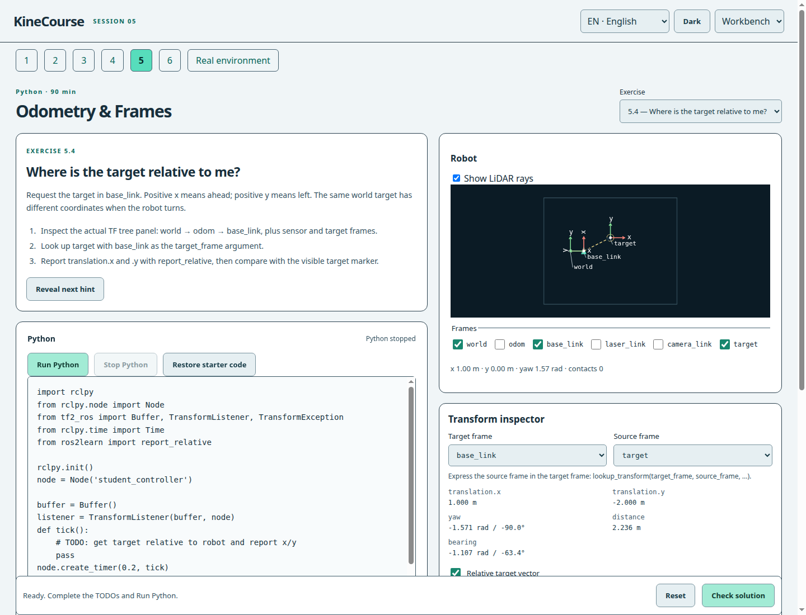

# KineCourse

Interactive robotics learning in your browser.

KineCourse is a free, open-source teaching environment for robotics communication, sensors, perception and coordinate frames. Students use real Python and interactive simulations without installing a robotics stack or creating an account. Exercises mirror common ROS™ 2 APIs and command-line workflows so the same concepts transfer to a real robotics workspace.

## Try online

[Open KineCourse](https://mariomlz99.github.io/ros2learn/). Start in Session 1; Python begins in Session 2. Chrome and Firefox are tested. Edge and Safari remain best-effort and have not been independently verified.

## What students learn

Nodes, topics, messages, publishers, subscribers, callbacks, LiDAR, camera arrays, services, parameters, actions, odometry, transforms and debugging. One shared runtime connects the terminals, Python and robot within each page.

No installation, account, backend, API key or paid service is required. The first Python run downloads Pyodide and NumPy; initial use requires internet.

## Workstation views

[Session 1](docs/media/session-01.png) · [Camera perception](docs/media/session-03.png) · [Debugging](docs/media/session-06.png). A short demonstration video is planned; see the [demo outline](docs/DEMO.md).

## Six-session course

Each session is designed for approximately 90 minutes. Sessions 1–2 introduce the basics; allow time for explanation and experimentation.

| Session | Focus | Exercises |
| --- | --- | --- |
| 1 | Nodes & Topics | CLI discovery and robot commands |
| 2 | Callbacks & LiDAR | 4 Python exercises |
| 3 | Perception & Services | 6 Python exercises |
| 4 | Parameters & Actions | 5 core exercises + optional cancellation |
| 5 | Odometry & Frames | 5 core exercises + obstacle integration |
| 6 | Debugging Challenge | 2 repairs + an integrated beacon mission |

The UI and teaching material support English, Nederlands, Français, Español, Deutsch and Português. Code, ROS identifiers and technical output remain English. Switching language preserves code and running Python. Light/dark and split/stacked layouts are available. Course timings and translations still need classroom and native-speaker review.

## For lecturers

Send students a URL and begin. No ROS installation, Docker, student cloud accounts or local Python setup. Exercises, worlds, hints and translations are version-controlled alongside the course.

Fork the repository, edit lesson JSON and enable Pages. See [AUTHORING.md](docs/AUTHORING.md), [course pacing](docs/COURSE.md) and [validation](docs/VALIDATION.md). No authoring GUI or grading database is required.

## How it works

Static HTML, CSS and JavaScript provide the workstation. Real Python and NumPy run in a Pyodide Web Worker. Educational message classes and robotics APIs connect student programs to the same graph used by the CLI. Canvas renders sensors and obstacles; SVG displays coordinate frames from actual runtime transforms.

Camera: 320 × 240 at 8 Hz. LiDAR: 120 rays at 5 Hz. Odometry: ideal 2D pose at 5 Hz. Stop terminates the worker, including an infinite loop. Slow callbacks drop sensor frames instead of accumulating work. Output and terminal history are bounded.

## Educational runtime and limitations

KineCourse is not a full robot middleware installation. Python, NumPy and student algorithms are real; rclpy, messages, services, parameters, actions, TF, cv_bridge, limited cv2 and the CLI are educational implementations.

No DDS, QoS negotiation, TF history, native OpenCV, Gazebo, RViz, Nav2, SLAM or native package builds. TF is planar and latest-only. The two-second velocity timeout is a simulator controller policy. Each tab has a separate world. See [architecture](docs/ARCHITECTURE.md) and the [About page](https://mariomlz99.github.io/ros2learn/about.html).

Checks observe behaviour and accept different solutions. They are formative, not tamper-proof grading. Reference programs are excluded from the production build but remain visible in this public repository. Browser source cannot securely hide answers or checkers.

## Local maintainer setup

Students need only a browser. Maintainers need Node 22+ for tests/build and Python 3 for the simple preview server; no npm dependencies are installed.

~~~bash
git clone https://github.com/mariomlz99/ros2learn.git
cd ros2learn
npm run dev
~~~

Open http://localhost:8000. Use HTTP, not file://.

~~~bash
npm test
npm run build
npm run test:chrome -- --built
npm run test:firefox -- --built
~~~

Browser tests require the corresponding installed browser and access to the Pyodide CDN. They exercise all reference programs, alternate implementations, negative controls, Stop/Reset, translations and numerical TF agreement. To run one suite:

~~~bash
node scripts/check-browser.mjs chrome --built --suite=tf-browser
~~~

## Deployment

GitHub repository Settings → Pages → Source: **GitHub Actions**. Pushes to main run tests, build and the complete Chrome suite before publishing dist/. Pull requests test without deploying.

Production contains static assets only. The allowlist excludes tests, reference programs, docs and private development artifacts. Content-versioned relative paths work under /ros2learn/ and other project prefixes. The existing personal website is a separate repository.

The repository remains ros2learn for now. A later move to kinecourse requires explicit approval; see [BRANDING.md](docs/BRANDING.md). Update the source URL in src/ui/product.js and documentation when migrating. No custom domain is configured.

## Authoring

Lesson catalogs and JSON files live in public/lessons/. They define tasks, starter code, hints, worlds, translations and behavioural checks. [AUTHORING.md](docs/AUTHORING.md) includes a minimal example and a validation workflow.

## Licence and trademarks

Original code and lessons are Apache-2.0: [LICENSE](LICENSE), [NOTICE](NOTICE). Pyodide, CPython and NumPy retain their own terms; see [third-party notices](licences.html).

ROS is a trademark of Open Source Robotics Foundation, Inc. KineCourse is an independent educational project and is not affiliated with or endorsed by Open Robotics.

KineCourse is a working name, not a claim of trademark clearance. The independent brand distinguishes the product from the technology taught; descriptive ROS 2 references and technical identifiers are retained.
