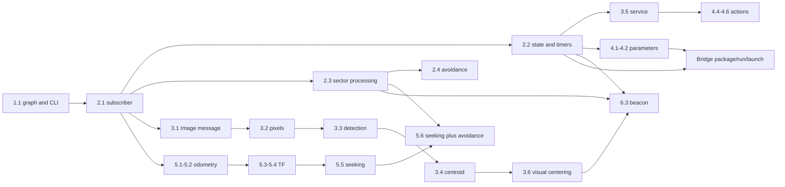

# Core scope and dependency audit

**Decision after review:** the user approved option A on 2026-10-06. See [Core / Further implementation](CORE_PATH_IMPLEMENTATION.md) for the accepted boundary and validation. The audit below records the pre-decision findings and options.

Audit baseline: `e2f1b8e663bbe53fefa9b5d1dc02bb1c8f26d374`, 2026-10-06. This document proposes options; it does **not** authorize or implement a curriculum move. The existing 26 exercises, six-session order and bridge remain available. Unpublished grouping experiments were reverted before this audit.

## Assessment

There is a real mixing of two learning objectives: understanding ROS communication/runtime concepts and designing perception/control algorithms. Concrete robotics examples are valuable. The boundary should be the **new work the learner must do**, not whether a camera, LiDAR or moving robot appears on screen.

- Keep a small sensor example when the new task is subscribing, inspecting fields, coordinating callbacks or interpreting frames.
- Treat image segmentation, centroid algorithms, control laws and obstacle-bypass strategies as application learning unless they are deliberately selected as a small synthesis exercise.
- A ROS concept can be essential while its current exercise implementation is replaceable. “Core role” below is a provisional judgment, not a decision to delete a lesson.
- No computer-vision computation is required for 3.5 services, 4.3 custom messages, 5.3–5.4 TF, or the bridge. A target-shaped example does not itself create a perception prerequisite.

Sources inspected: every lesson's description, steps, hints and both starters in `public/lessons`; catalog order; `src/exercises/{lesson,course,perception}.js`; runtime/report adapters; Python/C++ reference and negative programs; current browser suites; bridge page, workspace, build and process code. Prerequisites below are inferred from explicit reuse instructions and actual code tasks. Basic Python/C++ language knowledge is assumed throughout.

**Core-role terms:** Essential = retain the ROS concept; Supporting = useful concrete practice, with scope open to review; Extension = predominantly application/algorithm learning; Optional ROS = ROS learning that can remain a stretch exercise.

## Exercise-by-exercise map

### Session 1

| Exercise | ROS 2 objective | Application objective | Prerequisites | Core role | Simplification / possible later home | Effect of moving |
|---|---|---|---|---|---|---|
| 1.1 Discover and use /cmd_vel | Graph discovery, typed topics, CLI publication/inspection, explicit stop command | Interpret velocity and observe robot motion | None beyond terminal basics | Essential | Keep this concrete first success; explain the modeled watchdog | Foundational context for every sensor, motion and debugging task. Replace with an equivalent graph/publication introduction if moved. |

### Session 2

| Exercise | ROS 2 objective | Application objective | Prerequisites | Core role | Simplification / possible later home | Effect of moving |
|---|---|---|---|---|---|---|
| 2.1 First subscriber | Node, subscription, callback, message fields, inspecting an endpoint | Read a LaserScan sample; fixed forward index is explicitly contextualized | 1.1; functions/classes and indexing | Essential | Keep LiDAR as a concrete streaming example; no navigation algorithm needed | 2.2 and 2.3 use its pattern. Later sensor exercises need an equivalent subscription introduction. |
| 2.2 Callbacks are reactions | Distinguish subscription and timer events; preserve state; publish and inspect status | Sample the latest range at a separate periodic rate | 2.1; mutable state | Essential | Keep scan → state → timer → String. No self-subscription required | Important for live parameters, timer-based TF and sensor/control separation in 6.3. |
| 2.3 LiDAR sectors | Use message metadata correctly; process a sensor callback | Angular indexing, radians, wrapping, finite filtering, sector minima | 2.1; loops/minimum; elementary angles. 2.2 is helpful but not strictly required | Supporting / borderline | Could retain one simple forward-sector example, supply angular helpers, or move the full three-sector task to sensing/control practice | Explicit prerequisite of 2.4 and a useful basis for 5.6/6.3. 6.1 supplies its sector function. Moving it alone requires replacing these assumptions. TF 5.3 does not require this algorithm. |
| 2.4 Obstacle reaction | Compose subscriber and publisher into a live node | Reactive obstacle avoidance, thresholds and collision-aware motion | 1.1, 2.1, **2.3 explicitly reused** | Extension, with motivational value | Candidate for Further exercises / Control; alternatively retain a simpler stop-before-obstacle synthesis | 6.1 supplies this behavior in its broken controller, and 5.6/6.3 reuse the safety idea. Its removal does not break services/parameters/actions/bridge, but later control tasks need explicit preparation. |

### Session 3

| Exercise | ROS 2 objective | Application objective | Prerequisites | Core role | Simplification / possible later home | Effect of moving |
|---|---|---|---|---|---|---|
| 3.1 Camera subscriber | Transfer subscription pattern to another typed message; inspect width/height | Recognize image dimensions, without pixel processing | 2.1 | Supporting | Can stay as a short “another message type” exercise or become the opening of Perception | Direct introduction for 3.2. Can move with the vision block without affecting services or TF. |
| 3.2 Images are data | Interpret Image payload/encoding; Python conversion or C++ byte/stride access | Array shape, channel statistics, indexing and means | 3.1; Python NumPy or C++ loops/byte layout | Extension with useful message literacy | Keep only a small payload demonstration in Core if needed; full implementation belongs naturally in Perception | 3.3–3.4, 3.6 and 6.3 rely on its pixel-processing knowledge. It is not required by 3.5. |
| 3.3 Detect red | No major new ROS communication primitive; process data inside an existing callback | Color thresholds, masks, pixel count and detection decision | 3.2 | Extension | Perception; retain varied-scene behavioral checks | 3.4 and 3.6 use the mask; 6.3 uses the detector. Moving it requires moving those tasks or supplying a clearly labeled detector. |
| 3.4 Centroid / position label | Report/process information received through an existing subscription | Centroid, image coordinates, left/center/right classification | 3.3 and array/loop operations | Extension | Perception | 3.6 and 6.3 explicitly need centroid computation. 4.3 can publish typed sample fields without this algorithm. |
| 3.5 Service | Discovery, client, request, future/completion callback, response | Visible robot reset as an effect of a request | 1.1 and callback familiarity from 2.1–2.2; **no camera processing prerequisite** | Essential | Can be relocated independently to communication fundamentals | Supports comparison with actions in 4.4–4.5. Moving the whole current Session 3 out of Core would incorrectly remove services with vision. |
| 3.6 Find target | Combine subscription and velocity publication | Visual search, proportional angular correction, dead zone and stopping | 1.1, 3.3–3.4; bounded Twist publication | Extension / optional synthesis | Perception + Control or Further exercises | Important preparation for 6.3. Not necessary for basic TF, actions or package/launch learning. |

### Session 4

| Exercise | ROS 2 objective | Application objective | Prerequisites | Core role | Simplification / possible later home | Effect of moving |
|---|---|---|---|---|---|---|
| 4.1 Configure node | Declare a default, understand node ownership, inspect parameters | Fixed speed makes a node observable | 1.1, 2.2 | Essential | Keep declaration/inspection distinct from 4.2. A status publisher could replace motion if desired | 4.2 builds directly on it. Neither requires vision or avoidance. |
| 4.2 Tune live | Read current parameters while spinning; change via CLI without restart | Bound a speed command and observe its change | 4.1, 2.2 | Essential | Keep one clear parameter and visible change | Makes runtime configuration meaningful for the bridge launch parameter. Does not depend on perception/control algorithms. |
| 4.3 Custom message | Typed interface contract, fields, publication, interface inspection | TargetInfo provides concrete example fields | 1.1–2.2; constructing a message. **3.3–3.4 are not required** | Essential concept; current example replaceable | Could use a neutral status example, or retain manually supplied TargetInfo fields. Native interface generation is explained, not implemented here | Independent of the vision algorithm chain. Moving all “target” examples out would remove useful interface literacy unnecessarily. |
| 4.4 Action goal/result | Action discovery, goal acceptance, goal handle, asynchronous final result | Built-in server drives a requested distance | Callback/future model from 2.2/3.5; typed interface idea from 4.3 is helpful | Essential | Keep server behavior supplied. Remove feedback work from this starter if retaining 4.5 as the dedicated feedback lesson | Prerequisite for 4.5–4.6. No student controller implementation is required. |
| 4.5 Action feedback | Associate intermediate feedback with a goal; distinguish it from final result | Observe distance progress | 4.4 | Essential part of action literacy | Current prefilled goal/result scaffold correctly reduces reconstruction | Prerequisite for cancellation triggered by feedback in 4.6. |
| 4.6 Cancellation | Retain a goal handle; request cancellation; await terminal result | Stop an ongoing distance task once | 4.4–4.5; state flag | Optional ROS | Keep as optional action depth, not automatically a Perception/Control task | No later required exercise depends on it. Can move to optional communication practice with minimal consequences. |

### Session 5

| Exercise | ROS 2 objective | Application objective | Prerequisites | Core role | Simplification / possible later home | Effect of moving |
|---|---|---|---|---|---|---|
| 5.1 Odometry structure | Subscribe to nested Odometry data; distinguish pose and velocity fields | Read x/y and raw orientation | 1.1, 2.1 | Essential for this robot-focused Core | Keep field inspection separate from yaw conversion | 5.2 builds on it. Supports the spatial context of TF and debugging. |
| 5.2 Quaternion → yaw | Interpret orientation carried in a standard message; use an available conversion helper | Heading, radians and rotation | 5.1; basic angles | Supporting spatial foundation | Keep helper-based conversion and physical interpretation; avoid requiring a quaternion derivation | Useful for interpreting 5.3 and frame-debug results. TF lookup itself does not require manually implementing quaternion math. |
| 5.3 Sensor frames | TF tree, Buffer/Listener, lookup direction, startup availability, composition | Mounted sensor offset rotates with the robot | 2.2 timers, 5.1–5.2 spatial vocabulary | Essential TF example in the present Core | Keep the physical mount; it gives lookup/composition a reason. Does not require implementing LiDAR processing | Direct conceptual foundation for 5.4. Moving vision or sector algorithms does not break it if the simulated sensor/frame remains. |
| 5.4 Relative target | target_frame/source_frame semantics, transform to base_link | Interpret ahead/left and a known target's relative coordinates | 5.3 | Essential / strong TF example | Keep the preset target; state that it is already known, not detected by the learner | 5.5 and 6.2 rely on it. **No prerequisite from 3.3–3.4**: runtime supplies the target frame. |
| 5.5 TF goal controller | Repeated lookup integrated with publication/timer | Distance/bearing, proportional steering, saturation, alignment and stopping | 5.4, 2.2, Twist; hypot/atan2 | Extension / optional synthesis | Control or Further exercises. Basic TF literacy can finish at 5.4 | 5.6 explicitly reuses it. 6.2 supplies a broken version; its frame question can remain if the supplied algorithm is explained. |
| 5.6 TF + LiDAR safety | Combine asynchronous sensor state with timer-based TF | Avoidance priority, bypass memory/hysteresis and target seeking | **5.5 explicitly reused**, 2.3 sector idea, 2.2; 2.4 is helpful | Extension | Control / Applied robotics | No bridge dependency. Supports integration habits for 6.3 but is not a strict code prerequisite for the beacon algorithm. |

### Session 6

| Exercise | ROS 2 objective | Application objective | Prerequisites | Core role | Simplification / possible later home | Effect of moving |
|---|---|---|---|---|---|---|
| 6.1 Wrong topic | Diagnose endpoints/types and repair a topic mismatch | Supplied obstacle-avoidance controller must work after repair | 1.1, 2.1; 2.3–2.4 help explain supplied code | Essential debugging objective; application wrapper is replaceable | Can keep supplied behavior with an explicit explanation, or simplify to a publisher/subscriber failure with a matching checker | Current checker requires scan use, reaction, travel and no collision. Merely hiding 2.4 leaves a hidden behavioral expectation. Removing obstacle behavior also requires changing that checker and its tests. |
| 6.2 Wrong frame | Diagnose semantically wrong but numerically valid TF lookup | Supplied heading controller must reach a target after repair | 5.3–5.4; 5.5 helps explain the controller | Essential debugging objective; application wrapper is replaceable | Keep supplied steering and make the scope explicit, or debug reported relative coordinates without requiring a controller | Current goal checker requires reaching/stopping. Moving 5.5 need not force moving 6.2, but the prerequisite and assessment must be made deliberate. |
| 6.3 Beacon docking | Integrate multiple subscriptions, retained state, timer and publication | Red detection, centroid, search/steering, approach and LiDAR safety | 2.2–2.3, 3.2–3.4, 3.6; Twist; safety idea from 2.4. 5.6 is useful but not strictly required | Extension / substantial applied capstone | Applied robotics or a later Perception + Control capstone | Moving vision while keeping this as required Core would leave a real prerequisite gap. It is not a prerequisite for the bridge. |

### Core bridge and native transition

| Area | ROS 2 objective | Application objective | Prerequisites | Core role | Simplification / possible later home | Effect of moving |
|---|---|---|---|---|---|---|
| Package & Build checkpoint | Workspace/package layout, metadata, build/install definitions, code compilation | Two small provided String nodes | 1.1, 2.1–2.2; source files/editing | Essential for transfer to native ROS | Keep one language at a time and explain each file's role | Can follow communication fundamentals without vision, avoidance or a controller. |
| Run & Inspect checkpoint | Per-terminal sourcing, installed executables, concurrent nodes, graph/message inspection | Publisher/subscriber exchange | Package/build checkpoint; topics/subscriptions and graph debugging | Essential | Keep manual separate terminals before introducing launch | Supplies the concrete reason for launching multiple nodes together. |
| Launch & Debug checkpoint | Start a system, parameter propagation, remapping and graph diagnosis | Correct a disconnected two-node example | Prior checkpoints; parameters; graph inspection | Essential | Three existing checkpoints reduce pacing pressure | No dependency on LiDAR sectors, image processing, TF control or beacon docking. |
| Native transition | Export the same package; native build/source/run/launch and recognize model limits | Validate the same small system on Jazzy | Bridge; access to a suitable native ROS setup for execution | Essential transfer guidance | A native installation is an external environment, not another browser exercise | Current exported Python/C++ packages have native validation evidence. This is not proof for arbitrary learner edits or hardware. |

## Dependency clusters and cut points

The graph omits weak motivational links and separates debugging deliberately: 6.1 consumes a supplied avoidance implementation; 6.2 consumes a supplied steering implementation. They do not ask the learner to rebuild those algorithms, but their present checks require the algorithms to succeed.

**Potential safe cuts, subject to review:** move the coherent 3.2–3.4 → 3.6 → 6.3 algorithm chain together; leave services behind. Keep TF's known sensor/target context independently. Decide 2.3 separately because it teaches meaningful sensor metadata without yet designing a controller. Move 5.5 with 5.6 if control is deferred. Treat 4.6 as optional ROS depth rather than a robotics algorithm.

## Functionality is a separate gate

“Functional” should mean: a learner can start from the supplied code, use the visible instructions and stated prerequisites, produce valid behavior in Python or C++, inspect that behavior, and recover using Stop/Reset. A reference program passing alone proves only that a solution exists.

### What the current evidence establishes

- Unit/build and browser acceptance test execution, checks, negative controls, language/layout behavior and lifecycle cleanup. The final baseline's remote browser matrix was still running when this audit began; use the PR's actual results rather than carrying forward an older green commit.
- The added starter-path test fills the supplied TODOs for **4.1, 4.2, 4.5, 5.1 and 5.2**, in Python and C++, without loading reference programs. It is not an all-exercise novice walkthrough.
- That test exposed a missing C++ protocol entry for `report_position`; it was fixed before baseline `e2f1b8e`, and the C++ starter path passed afterward.
- Fresh native exports passed build, source, manual communication and launch/remapping/parameter checks. This validates the native bridge examples, not every course algorithm.
- No independent human completion of all 26 exercises from only visible material has been established by this audit. The external review must not be represented as done until its actual findings arrive.
- Audit follow-up validation: all 84 unit tests passed; the five changed starter exercises passed again on Chrome in both Python and C++ after the 4.1 checker correction. The baseline commit's Chrome/Firefox CI browser jobs remain in progress. The audit and focused checker correction are local changes pending review; they are not deployed.

### Concrete gaps found in this audit

1. **4.4/4.5 still overlap in Python.** 4.4's starter has a feedback TODO and asks to pass `feedback_callback=feedback`, while its description/check focuses on the final result and 4.5 is meant to introduce feedback. This is visible starter/curriculum drift, even if a complete program passes.
2. **4.1's checker overclaims movement.** At the audit baseline it checks declaration plus three `/cmd_vel` publications. A direct reproduction declared speed, published three zero Twists and obtained a passing “published motion” check with robot distance 0. This was an assessment defect, independent of course restructuring. The audit follow-up corrects it by requiring positive student velocity commands and observed travel, with a regression covering zero commands even after external motion.
3. **6.1/6.2 have behavioral prerequisites hidden behind debugging objectives.** Their code is supplied, but their checks require avoidance/goal-reaching. A future move must address code, explanation and checker together.
4. **2.2's evidence does not prove callback causality.** It counts timers and typed `/chatter` publications separately. It demonstrates that both occurred, not that each status publication was made from the timer using updated sensor state. This is an assessment limit to decide deliberately, not a demonstrated execution failure.
5. **3.4's checker validates centroid evidence, not printed LEFT/CENTER/RIGHT prose.** This can be acceptable if the centroid is the graded outcome and the label is a reflection task; the lesson should distinguish those claims.
6. **5.1 validates correct x/y, while quaternion/velocity inspection remains guided observation.** Again, execution success is not proof that every explanatory question was understood.
7. **The browser `ros2 pkg create` supplies a teaching two-node scaffold.** Native `ros2 pkg create` without extra code does not manufacture this completed publisher/subscriber pair. Export validity and familiarity of commands should not obscure that instructional convenience.

Items 1 and 3 deserve a curriculum decision before conceptual freeze; item 2 received the focused assessment fix described above. Fixing an assessment defect is not a reason to move whole modules. No changes to exercise placement are included in this audit.

## Restructuring options for review

| Option | Required path | Applied exercises | Advantages | Costs / risks |
|---|---|---|---|---|
| **A. Preserve six sessions; distinguish Core and Further exercises** | Retain current six session containers. Mark a reviewed subset required; keep small LiDAR/Image examples and basic TF. Bridge remains required. | Explicit optional section/links, preserving original files and tests | Lowest migration cost; concrete early successes; easy to review incrementally | Mixed topics remain within pages unless the required route is clearly guided. Numbering/order and 6.1/6.2 prerequisites still need deliberate work. |
| **B. Recompose six ROS-focused modules** | 1 Nodes/topics; 2 publishers/subscribers/callbacks/timers; 3 services/parameters/actions/interfaces; 4 odometry/TF; 5 debugging; 6 package/build/run/launch, then native guide | Separate Further exercises now; later group as Perception, Control and Applied robotics when each track is coherent | Clearest conceptual boundary and native transition; services no longer appear to require vision | Larger navigation/catalog/translation/test migration. Module 3 could become overloaded; requires pacing review and preserved deep links. Must keep meaningful physical examples to avoid a dry API tour. |
| **C. Preserve the full current course; add a short required route** | Keep all content and current order, but give a prerequisite-aware “Core route” through selected lessons | Existing remaining lessons labeled optional practice | Fastest reversible experiment; allows a novice pilot before moving content | Easy for learners to confuse optional work with required progression; does not resolve the mixed session names. Risk of two competing course maps. |

### Recommendation, not implementation

Use **A as the smallest reviewable change if the aim is to finish this release without reorganizing every page**. Use **B if six coherent fundamentals modules are now the product goal**; it is a better long-term map, but should be treated as an explicit curriculum revision with its own pacing review. C is suitable for a short pilot, not a final frozen presentation.

Do not select the final moves just by the words “LiDAR,” “camera,” “target” or “control.” First decide the intended Core outcomes and one minimum motivating example for each. In particular, review 2.3, 3.1, 5.2 and the supplied-controller debugging tasks individually.

## Review decisions needed before a move

1. Choose A, B or a limited pilot of C.
2. Decide whether 2.3 remains a small metadata exercise or becomes optional sensor processing.
3. Decide whether 3.1 stays as message-type transfer; keep 3.5 services independent regardless.
4. Decide whether 6.1/6.2 retain explained supplied controllers or receive simpler assessments.
5. Define the required starter-only functional acceptance pass and obtain the external learner review.

Until those decisions are reviewed, keep the course structure unchanged and leave the conceptual Core freeze open. A green CI result is technical evidence, not an answer to these curriculum decisions.
